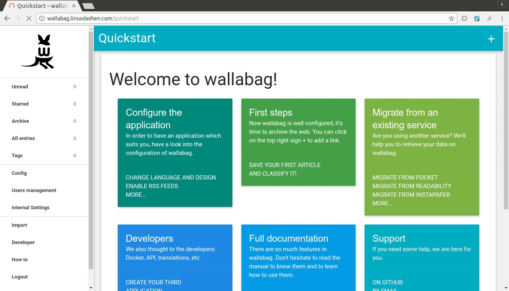

<!--
N.B.: This README was automatically generated by https://github.com/YunoHost/apps/tree/master/tools/README-generator
It shall NOT be edited by hand.
-->

# Wallabag pour YunoHost

[](https://dash.yunohost.org/appci/app/wallabag2)  

[](https://install-app.yunohost.org/?app=wallabag2)

*[Read this readme in english.](./README.md)*

> *Ce package vous permet d’installer Wallabag rapidement et simplement sur un serveur YunoHost.
Si vous n’avez pas YunoHost, regardez [ici](https://yunohost.org/#/install) pour savoir comment l’installer et en profiter.*

## Vue d’ensemble

Wallabag est une application de lecture différée : elle  permet simplement d’archiver une page web en ne conservant que le contenu. Les éléments superflus (menus, publicités, etc.) sont supprimés.
Sont disponibles une interface web, des add-ons pour navigateurs (Firefox/Chrome/Opera), des applications pour mobile (Android/iOS/Windows Phone) et même sur liseuse (PocketBook/Kobo).


**Version incluse :** 2.5.4~ynh5

**Démo :** https://demo.yunohost.org/wallabag/

## Captures d’écran



## Documentations et ressources

* Site officiel de l’app : <https://www.wallabag.org>
* Documentation officielle de l’admin : <https://doc.wallabag.org/en/>
* Dépôt de code officiel de l’app : <https://github.com/wallabag/wallabag>
* Documentation YunoHost pour cette app : <https://yunohost.org/app_wallabag2>
* Signaler un bug : <https://github.com/YunoHost-Apps/wallabag2_ynh/issues>

## Informations pour les développeurs

Merci de faire vos pull request sur la [branche testing](https://github.com/YunoHost-Apps/wallabag2_ynh/tree/testing).

Pour essayer la branche testing, procédez comme suit.

``` bash
sudo yunohost app install https://github.com/YunoHost-Apps/wallabag2_ynh/tree/testing --debug
ou
sudo yunohost app upgrade wallabag2 -u https://github.com/YunoHost-Apps/wallabag2_ynh/tree/testing --debug
```

**Plus d’infos sur le packaging d’applications :** <https://yunohost.org/packaging_apps>