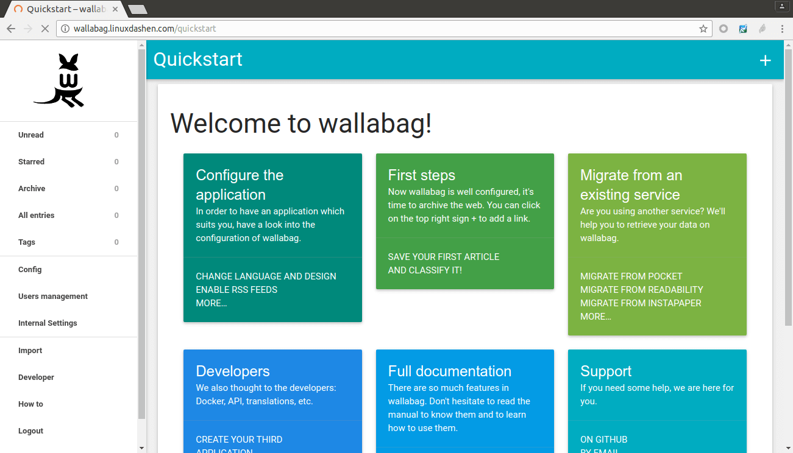

<!--
NOTA: Este README foi creado automáticamente por <https://github.com/YunoHost/apps/tree/master/tools/readme_generator>
NON debe editarse manualmente.
-->

# Wallabag para YunoHost

[](https://ci-apps.yunohost.org/ci/apps/wallabag2/)


[](https://install-app.yunohost.org/?app=wallabag2)

*[Le este README en outros idiomas.](./ALL_README.md)*

> *Este paquete permíteche instalar Wallabag de xeito rápido e doado nun servidor YunoHost.*  
> *Se non usas YunoHost, le a [documentación](https://yunohost.org/install) para saber como instalalo.*

## Vista xeral

Wallabag is a self hostable Read-It-Later application allowing you to not miss any content anymore. Click, save, read it when you can.
It provides a web interface, browser (Firefox/Chrome/Opera) add-ons, mobile apps (Android/iOS/Windows Phone) and even on e-reader (PocketBook/Kobo).

Upgrade from the YunoHost [Wallabag v1](https://github.com/YunoHost-Apps/wallabag_ynh) app requires a manual operation. That's why it's provided as a new package. For the migration process, please refer to the [Wallabag official documentation](https://doc.wallabag.org/en/user/import/wallabagv1.html).


**Versión proporcionada:** 2.5.4~ynh11

**Demo:** <https://demo.yunohost.org/wallabag/>

## Capturas de pantalla



## Documentación e recursos

- Web oficial da app: <https://www.wallabag.org>
- Documentación oficial para admin: <https://doc.wallabag.org/en/>
- Repositorio de orixe do código: <https://github.com/wallabag/wallabag>
- Tenda YunoHost: <https://apps.yunohost.org/app/wallabag2>
- Informar dun problema: <https://github.com/YunoHost-Apps/wallabag2_ynh/issues>

## Info de desenvolvemento

Envía a túa colaboración á [rama `testing`](https://github.com/YunoHost-Apps/wallabag2_ynh/tree/testing).

Para probar a rama `testing`, procede deste xeito:

```bash
sudo yunohost app install https://github.com/YunoHost-Apps/wallabag2_ynh/tree/testing --debug
ou
sudo yunohost app upgrade wallabag2 -u https://github.com/YunoHost-Apps/wallabag2_ynh/tree/testing --debug
```

**Máis info sobre o empaquetado da app:** <https://yunohost.org/packaging_apps>
